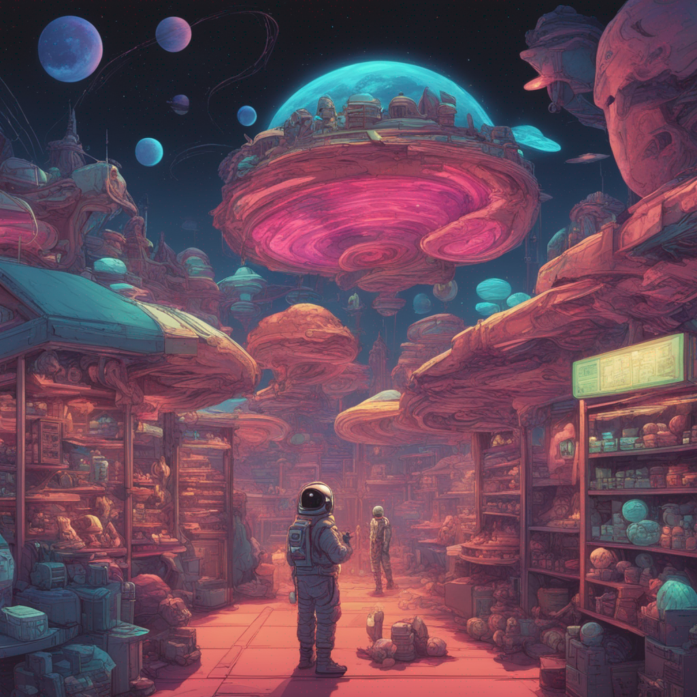
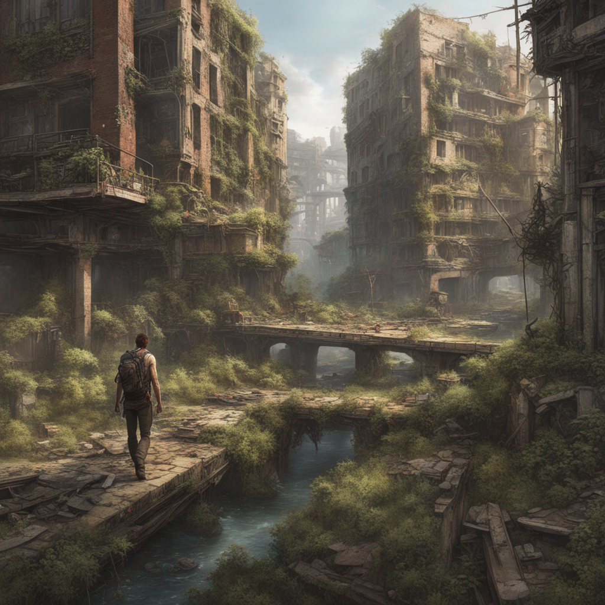
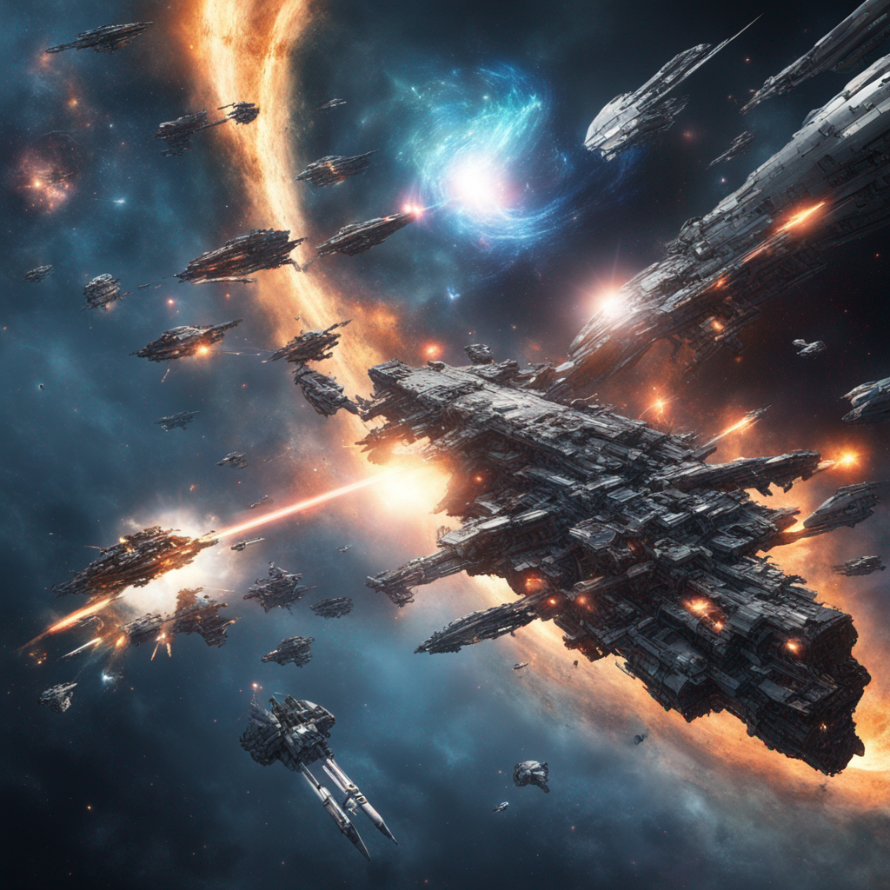

# CreativeAI-Portraits

## Project Overview
This portfolio showcases images generated using various versions of Stable Diffusion models. The images were created in a Colab notebook and demonstrate the model's capability to generate detailed, creative, and complex images from textual prompts.

### Objectives
- To explore and compare the capabilities of different versions of Stable Diffusion.
- To create a diverse set of images based on a range of prompts, showcasing creativity and detail.
- To serve as a mini-portfolio demonstrating the potential applications of AI-generated art.

## Generated Images

Below are the images generated using the specified versions of Stable Diffusion, along with the prompts used.

### Stable-Difussion XL Version Images

#### 1. Serene Lake Sunset Mountains
**Prompt**: "A serene landscape featuring a crystal-clear lake mirroring the vibrant, fiery hues of a sunset, with majestic mountains in the background and a field of wildflowers in the foreground."


#### 2. Astronaut Neon Alien Marketplace
**Prompt**: "An astronaut exploring a neon-lit alien marketplace, filled with various extraterrestrial species trading exotic goods, under a sky with three moons."


#### 3. PostApocalyptic Cityscape Nature
**Prompt**: "A post-apocalyptic cityscape where nature has reclaimed the ruins, with overgrown buildings, a river running through the main street, and survivors foraging for resources."


#### 4. Cyberpunk Street Noir
**Prompt**: "A cyberpunk street scene at night, with neon signs in multiple languages, diverse crowds, flying vehicles overhead, and a noir detective observing from the shadows."


#### 5. Ancient Library Monastery
**Prompt**: "A vast library in an ancient monastery, with towering shelves filled with ancient tomes, scrolls, and artifacts, and a secret passage hidden behind one of the bookcases."


#### 6. Epic Space Battle Galaxy
**Prompt**: "An epic space battle with sleek starships, exploding stars, and a massive space station, all set against the backdrop of a swirling galaxy."


## Technical Details

- **Environment**: Google Colab Notebook
- **Models Used**: SDXL-Turbo, stable-diffusion-xl-base-1.0, and stable-diffusion-xl-refiner-1.0 (refiner)
- **Languages & Libraries**: Python, PyTorch, diffusers library

## Observations and Insights

Creating images with the Stable Diffusion XL version and its refiner provided a fascinating insight into the capabilities of modern AI-driven art generation. The refiner model, in particular, added an extra layer of detail and polish to the images that significantly enhanced their quality.

One key observation was the difference in image fidelity and coherence when using the base model versus the refiner. The base model provided a strong foundation, but the refiner brought the images to life, enhancing subtle details and textures.

However, using the refiner also introduced additional complexity and computation requirements. Managing resources efficiently, especially in a Google Colab environment, became crucial. Balancing the image quality with the available computational resources was a constant challenge.

The prompts played a significant role in the quality of the generated images. More descriptive and detailed prompts generally yielded better results, indicating the model's strong reliance on textual guidance.

## How to Use

To generate your own images using the provided Colab notebook, follow these steps:

1. **Set Up Your Environment**: Open the notebook in Google Colab and connect to a runtime (preferably with GPU support for faster processing).
2. **Install Required Libraries**: Ensure that PyTorch, diffusers, and any other required libraries are installed in your environment.
3. **Load the Models**: Use the provided code to load the base and refiner models. Make sure you have access to these models from Hugging Face or the appropriate source.
4. **Define Your Prompt**: Replace the placeholder prompt with your desired text to guide the image generation.
5. **Generate the Image**: Run the code to generate the image. You can tweak parameters like the seed or the number of inference steps for different results.
6. **View and Save Your Image**: The generated image will be displayed in the notebook, and you can save it to your desired location.

Note: The process may require some adjustments based on your specific setup and the resources of your Colab environment.

## Acknowledgements

Special thanks to the creators and maintainers of the Stable Diffusion models and the diffusers library. Their work has made it possible to explore and push the boundaries of AI-generated art.

---

# Sample Code for Image Generation

```python
# Import required libraries
import torch
import mediapy as media
import random
import sys

# Import the DiffusionPipeline from diffusers
from diffusers import DiffusionPipeline
from diffusers import AutoPipelineForText2Image

# Initialize the DiffusionPipeline with a pre-trained base model
pipe = DiffusionPipeline.from_pretrained(
    "stable-diffusion-xl-base-1.0",
    torch_dtype=torch.float16,
    use_safetensors=True,
    variant="fp16",
)

# Check if using refiner
use_refiner = True  # Set this to False if you don't want to use the refiner
if use_refiner:
    # Initialize a DiffusionPipeline with a pre-trained refiner model
    refiner = DiffusionPipeline.from_pretrained(
        "stable-diffusion-xl-refiner-1.0",
        text_encoder_2=pipe.text_encoder_2,
        vae=pipe.vae,
        torch_dtype=torch.float16,
        use_safetensors=True,
        variant="fp16",
    )

    # Move the refiner model to CUDA (GPU)
    refiner = refiner.to("cuda")

    # Enable model CPU offload for the base pipeline
    pipe.enable_model_cpu_offload()
else:
    # Move the base pipeline to CUDA (GPU)
    pipe = pipe.to("cuda")

# Specify a prompt for image generation
prompt = "an outdoor sculpture of a head using discarded car parts, highlighting its beauty, highly detailed, 8k"
# Generate a random seed
seed = random.randint(0, sys.maxsize)

# Use the pipeline to generate images based on the prompt
images = pipe(
    prompt=prompt,
    output_type="latent" if use_refiner else "pil",
    generator=torch.Generator("cuda").manual_seed(seed),
).images

# If using the refiner, refine the images
if use_refiner:
    images = refiner(
        prompt=prompt,
        image=images,
    ).images

# Print the prompt and seed
print(f"Prompt:\t{prompt}\nSeed:\t{seed}")

# Display the generated images
media.show_images(images)

# Save the first image as "output.jpg"
images[0].save("output.jpg")
```

---

Generated with ❤️ using [Stable Diffusion](https://stablediffusionweb.com/)
