# CreativeAI-Portraits

## Project Overview
This portfolio showcases images generated using various versions of Stable Diffusion models. The images were created in a Colab notebook and demonstrate the model's capability to generate detailed, creative, and complex images from textual prompts.

### Objectives
- To explore and compare the capabilities of different versions of Stable Diffusion.
- To create a diverse set of images based on a range of prompts, showcasing creativity and detail.
- To serve as a mini-portfolio demonstrating the potential applications of AI-generated art.

## Generated Images

Below are the images generated using the specified versions of Stable Diffusion, along with the prompts used.

### Stable-Difussion XL Base-Refiner Version

#### Base Model
- **Model Name:** sd_xl_base_1.0.safetensors
- **Description:** The base model serves as the foundation for our image generation process, utilizing a deep neural network trained on a diverse dataset of professional photographs to understand and replicate high-quality imagery.
- **Configuration:**
  - **Resolution:** 1024x1024 pixels for high detail.
  - **Steps:** Initially set to 50 steps, allowing the model to iteratively refine the image output for accuracy and detail.

#### Refiner Model
- **Model Name:** sd_xl_refiner_1.0.safetensors
- **Description:** The refiner model enhances the images generated by the base model, focusing on improving realism, texture, and lighting to achieve a hyper-realistic look akin to professional photography.
- **Configuration:**
  - **End Steps:** Increased to 40 steps in the refinement phase to further polish and detail each image.
  - **Sampling Method:** Utilizes advanced sampling techniques to improve the clarity and realism of the final images.
 
#### Image Generation Process
1. **Input Prompts:** Detailed positive and negative prompts guide the AI to produce specific scenes with desired qualities and avoid undesired attributes.
2. **Base Model Generation:** The base model generates an initial image based on the input prompts.
3. **Refinement:** The refiner model applies additional processing to enhance the realism and detail of the image.

Generated images:

### Astronaut Exploring a Distant Planet
- **Positive Prompt:** An astronaut exploring the rugged terrain of a distant, alien planet, with towering rock formations and a vividly colored sky in the background. The astronaut's suit is detailed, reflecting the harsh environment and the sense of isolation. The style is cinematic and realistic, emphasizing the vastness and mystery of extraterrestrial exploration.
- **Negative Prompts:** familiar Earth landscapes, crowded, urban settings, abstract, oversimplified, traditional, day-to-day activities.
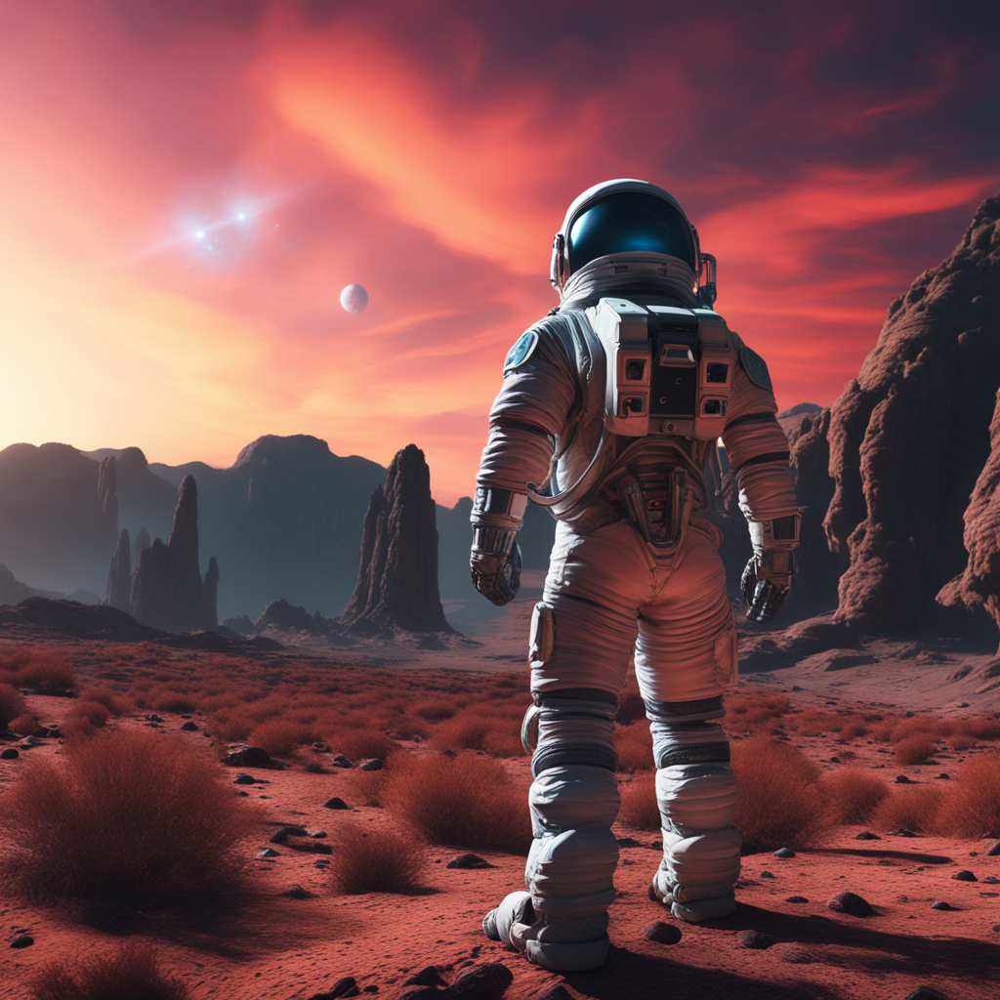

### Raindrops on a Window Overlooking a Cityscape
- **Positive Prompt:** A close-up of raindrops on a window with a twilight cityscape background, focusing on the clarity of raindrops with city light reflections, mimicking a high aperture lens effect.
- **Negative Prompts:** bright daylight, clear skies, oversimplification, abstract elements, wide focus.
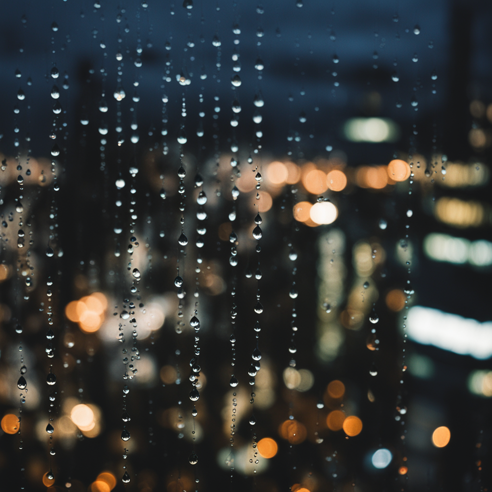

### Art Nouveau Inspired Garden Party
- **Positive Prompt:** An elegant garden party set in a lush, blooming garden with an Art Nouveau-inspired design, featuring flowing organic lines, intricate floral arrangements, and guests in period attire. The lighting is soft and warm, highlighting the delicate details of the dresses and the natural beauty of the setting. The style is detailed and romantic, capturing the whimsical and refined atmosphere of the Art Nouveau era.
- **Negative Prompts:** modern, industrial, cold lighting, minimalistic, abstract, sparse vegetation, monochromatic.
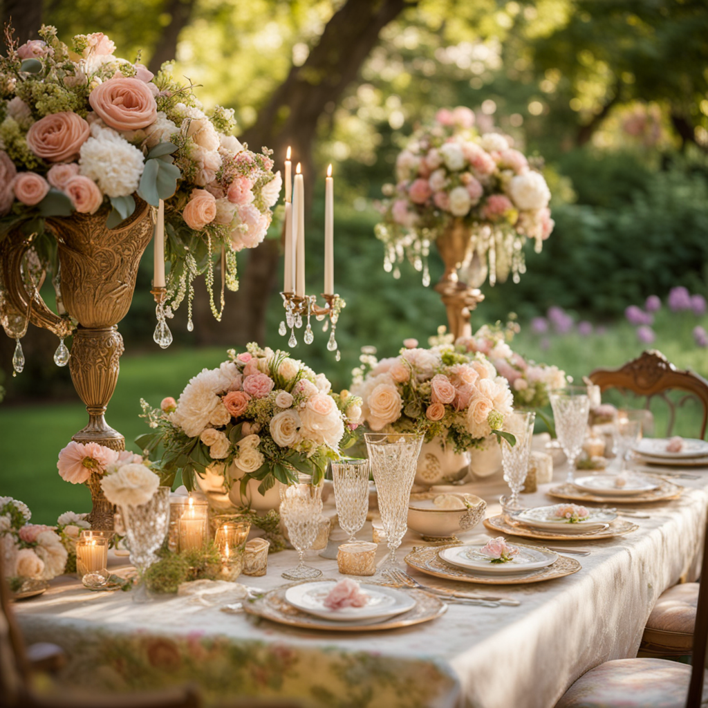

### Close-Up of a Dew-Covered Spider Web
- **Positive Prompt:** A macro photo of a dew-covered spider web, showcasing crystal-clear dewdrops and a sharply defined web pattern against a blurred background, akin to professional macro photography.
- **Negative Prompts:** wide shots, dry conditions, blurred details, abstract, high ISO noise.
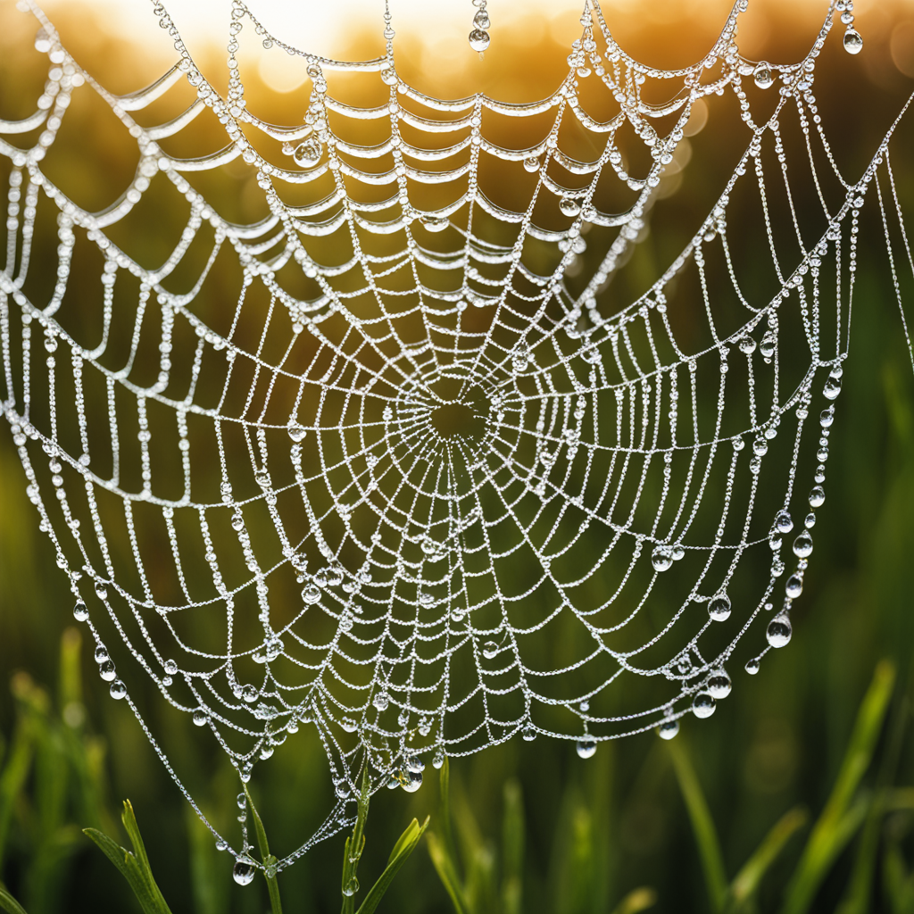

### Night Sky Full of Stars Above a Silhouetted Landscape
- **Positive Prompt:** A night sky filled with stars over a silhouetted landscape, capturing the clarity and depth of astrophotography, with the Milky Way visible and stars sharply rendered.
- **Negative Prompts:** daylight scenes, urban light pollution, motion blur, lack of detail, oversaturated colors.
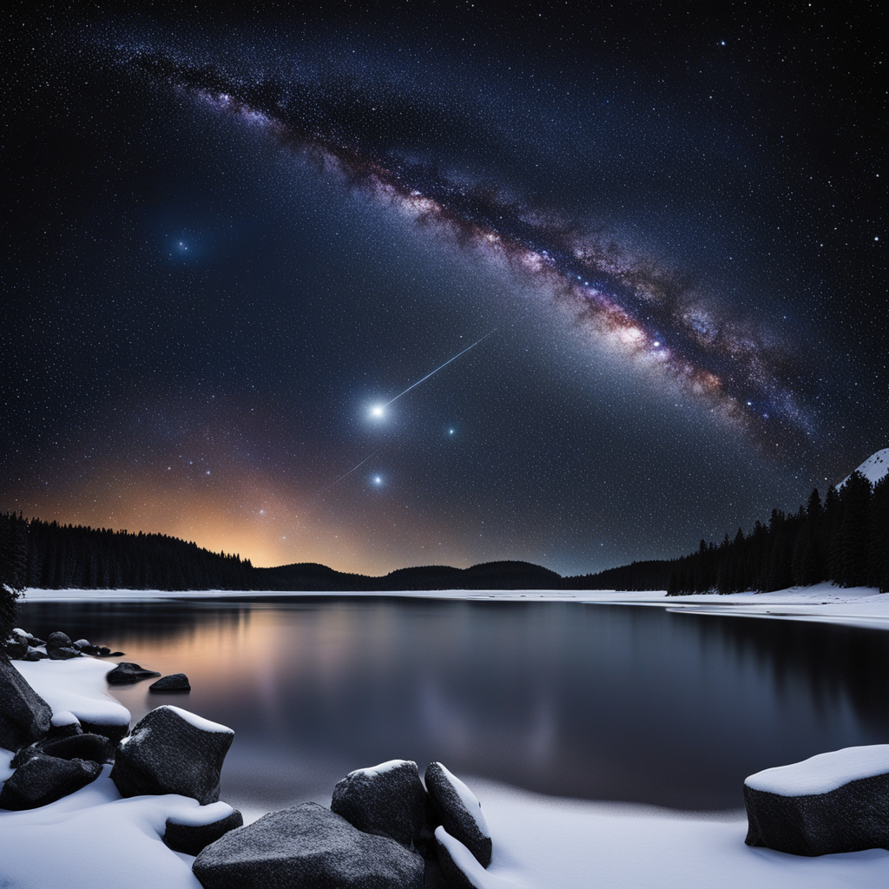

### Workflow
- Preservation of fine details and image sharpness.

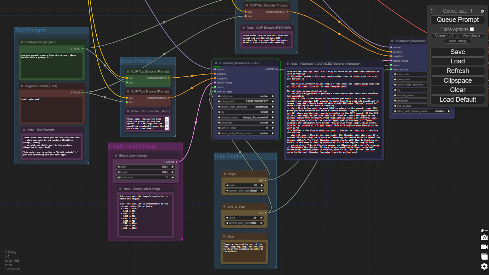

### Image-to-Video Transformation with Stable Diffusion

This section of the project demonstrates the innovative application of the Stable Diffusion model to transform static images into dynamic videos. By iteratively modifying the image and applying nuanced changes, we simulate motion and create a video sequence that brings the original image to life.

#### Stable Diffusion Model Configuration
- **Model Version:** svd_xt.safetensors
- **Base Configuration:** Details the initial settings and parameters for generating the starting image.
  - **Resolution:** 1024x576 pixels

#### Image-to-Video Conversion
- **Methodology:** Stable Video Diffusion (SVD) Image-to-Video is a diffusion model that takes in a still image as a conditioning frame, and generates a video from it.
- **Frame Generation:** This model was trained to generate 25 frames at resolution 1024x576 given a context frame of the same size.
- **Video Specifications:**
  - **Frame Rate:** 6 frames per second
  - **Resolution:** 1024 (width) x 576 (height)
  - **Length:** 4.166 seconds

### Examples

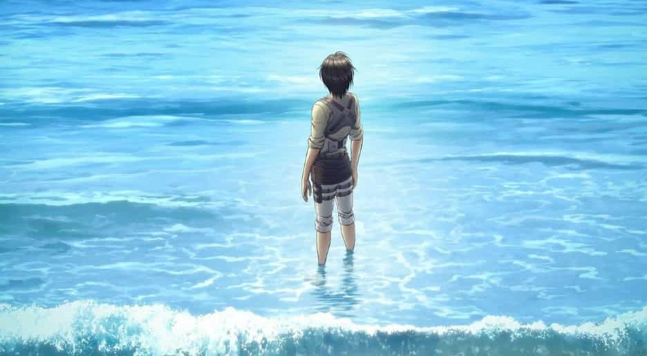

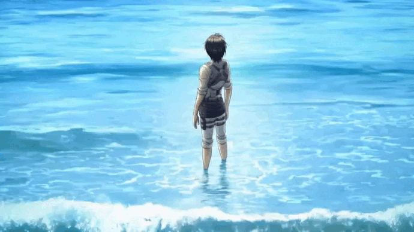

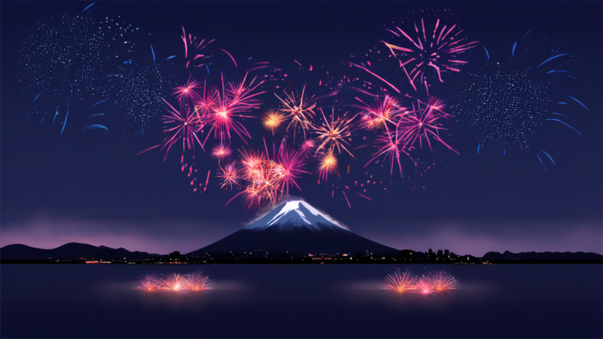

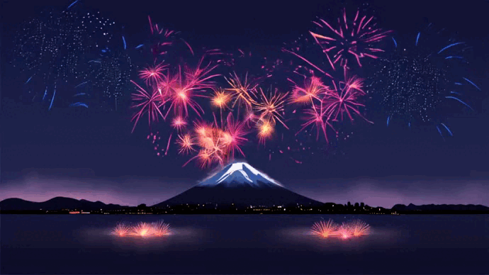

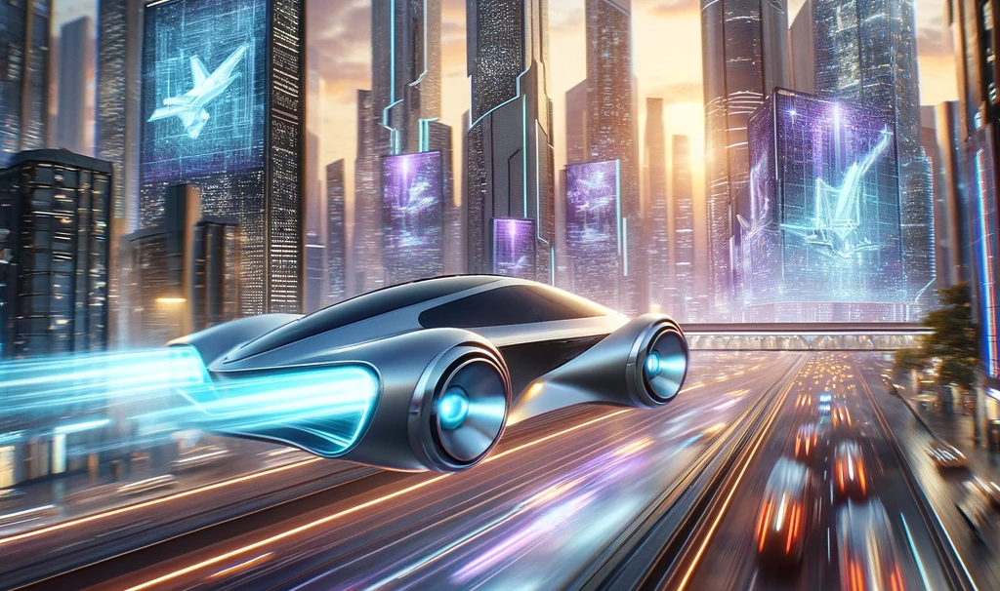


### Stable-Difussion XL Version Images

#### 1. Serene Lake Sunset Mountains
**Prompt**: "A serene landscape featuring a crystal-clear lake mirroring the vibrant, fiery hues of a sunset, with majestic mountains in the background and a field of wildflowers in the foreground."


#### 2. Astronaut Neon Alien Marketplace
**Prompt**: "An astronaut exploring a neon-lit alien marketplace, filled with various extraterrestrial species trading exotic goods, under a sky with three moons."


#### 3. PostApocalyptic Cityscape Nature
**Prompt**: "A post-apocalyptic cityscape where nature has reclaimed the ruins, with overgrown buildings, a river running through the main street, and survivors foraging for resources."


#### 4. Ancient Library Monastery
**Prompt**: "A vast library in an ancient monastery, with towering shelves filled with ancient tomes, scrolls, and artifacts, and a secret passage hidden behind one of the bookcases."


#### 5. Epic Space Battle Galaxy
**Prompt**: "An epic space battle with sleek starships, exploding stars, and a massive space station, all set against the backdrop of a swirling galaxy."


## Technical Details

- **Environment**: Google Colab Notebook
- **Models Used**: SDXL-Turbo, stable-diffusion-xl-base-1.0, and stable-diffusion-xl-refiner-1.0 (refiner)
- **Languages & Libraries**: Python, PyTorch, diffusers library

## Observations and Insights

Creating images with the Stable Diffusion XL version and its refiner provided a fascinating insight into the capabilities of modern AI-driven art generation. The refiner model, in particular, added an extra layer of detail and polish to the images that significantly enhanced their quality.

One key observation was the difference in image fidelity and coherence when using the base model versus the refiner. The base model provided a strong foundation, but the refiner brought the images to life, enhancing subtle details and textures.

However, using the refiner also introduced additional complexity and computation requirements. Managing resources efficiently, especially in a Google Colab environment, became crucial. Balancing the image quality with the available computational resources was a constant challenge.

The prompts played a significant role in the quality of the generated images. More descriptive and detailed prompts generally yielded better results, indicating the model's strong reliance on textual guidance.

## How to Use

To generate your own images using the provided Colab notebook, follow these steps:

1. **Set Up Your Environment**: Open the notebook in Google Colab and connect to a runtime (preferably with GPU support for faster processing).
2. **Install Required Libraries**: Ensure that PyTorch, diffusers, and any other required libraries are installed in your environment.
3. **Load the Models**: Use the provided code to load the base and refiner models. Make sure you have access to these models from Hugging Face or the appropriate source.
4. **Define Your Prompt**: Replace the placeholder prompt with your desired text to guide the image generation.
5. **Generate the Image**: Run the code to generate the image. You can tweak parameters like the seed or the number of inference steps for different results.
6. **View and Save Your Image**: The generated image will be displayed in the notebook, and you can save it to your desired location.

Note: The process may require some adjustments based on your specific setup and the resources of your Colab environment.

## Acknowledgements

Special thanks to the creators and maintainers of the Stable Diffusion models and the diffusers library. Their work has made it possible to explore and push the boundaries of AI-generated art.

---

# Sample Code for Image Generation

```python
# Import required libraries
import torch
import mediapy as media
import random
import sys

# Import the DiffusionPipeline from diffusers
from diffusers import DiffusionPipeline
from diffusers import AutoPipelineForText2Image

# Initialize the DiffusionPipeline with a pre-trained base model
pipe = DiffusionPipeline.from_pretrained(
    "stable-diffusion-xl-base-1.0",
    torch_dtype=torch.float16,
    use_safetensors=True,
    variant="fp16",
)

# Check if using refiner
use_refiner = True  # Set this to False if you don't want to use the refiner
if use_refiner:
    # Initialize a DiffusionPipeline with a pre-trained refiner model
    refiner = DiffusionPipeline.from_pretrained(
        "stable-diffusion-xl-refiner-1.0",
        text_encoder_2=pipe.text_encoder_2,
        vae=pipe.vae,
        torch_dtype=torch.float16,
        use_safetensors=True,
        variant="fp16",
    )

    # Move the refiner model to CUDA (GPU)
    refiner = refiner.to("cuda")

    # Enable model CPU offload for the base pipeline
    pipe.enable_model_cpu_offload()
else:
    # Move the base pipeline to CUDA (GPU)
    pipe = pipe.to("cuda")

# Specify a prompt for image generation
prompt = "an outdoor sculpture of a head using discarded car parts, highlighting its beauty, highly detailed, 8k"
# Generate a random seed
seed = random.randint(0, sys.maxsize)

# Use the pipeline to generate images based on the prompt
images = pipe(
    prompt=prompt,
    output_type="latent" if use_refiner else "pil",
    generator=torch.Generator("cuda").manual_seed(seed),
).images

# If using the refiner, refine the images
if use_refiner:
    images = refiner(
        prompt=prompt,
        image=images,
    ).images

# Print the prompt and seed
print(f"Prompt:\t{prompt}\nSeed:\t{seed}")

# Display the generated images
media.show_images(images)

# Save the first image
images[0].save(prompt.split(",")[0].replace(" ", "_") + ".png")
```

---

Generated with ❤️ using [Stable Diffusion](https://stablediffusionweb.com/)
