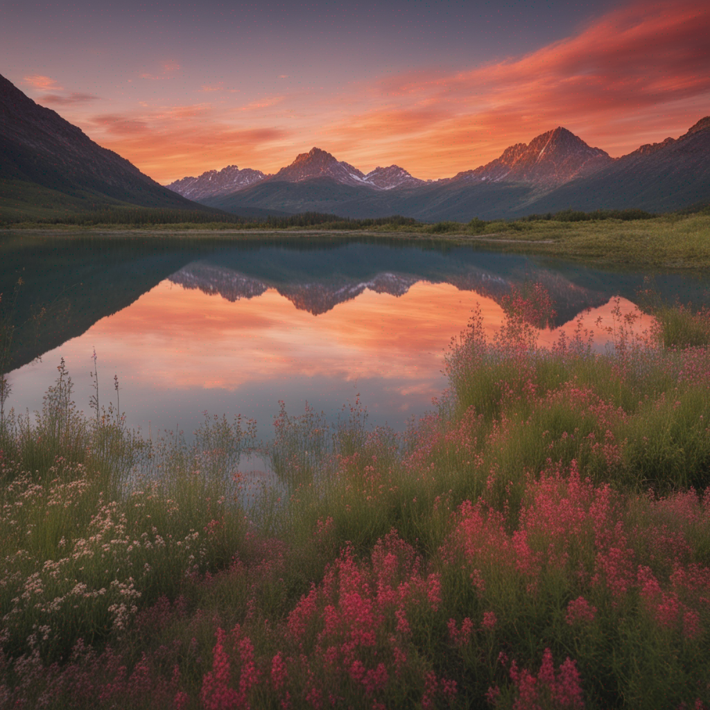
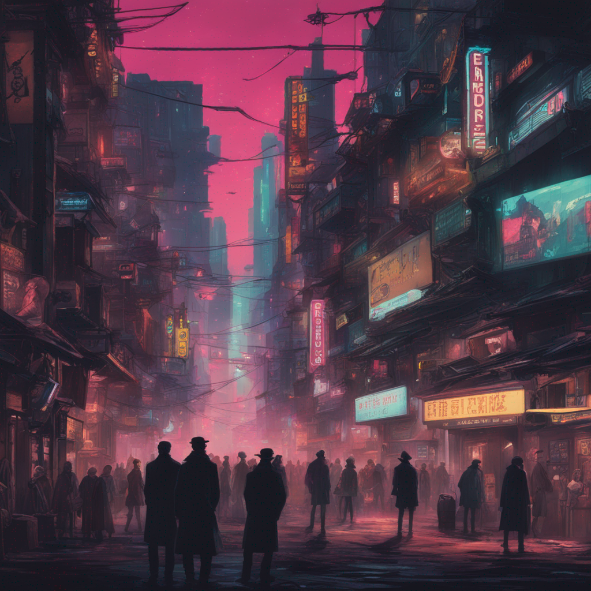
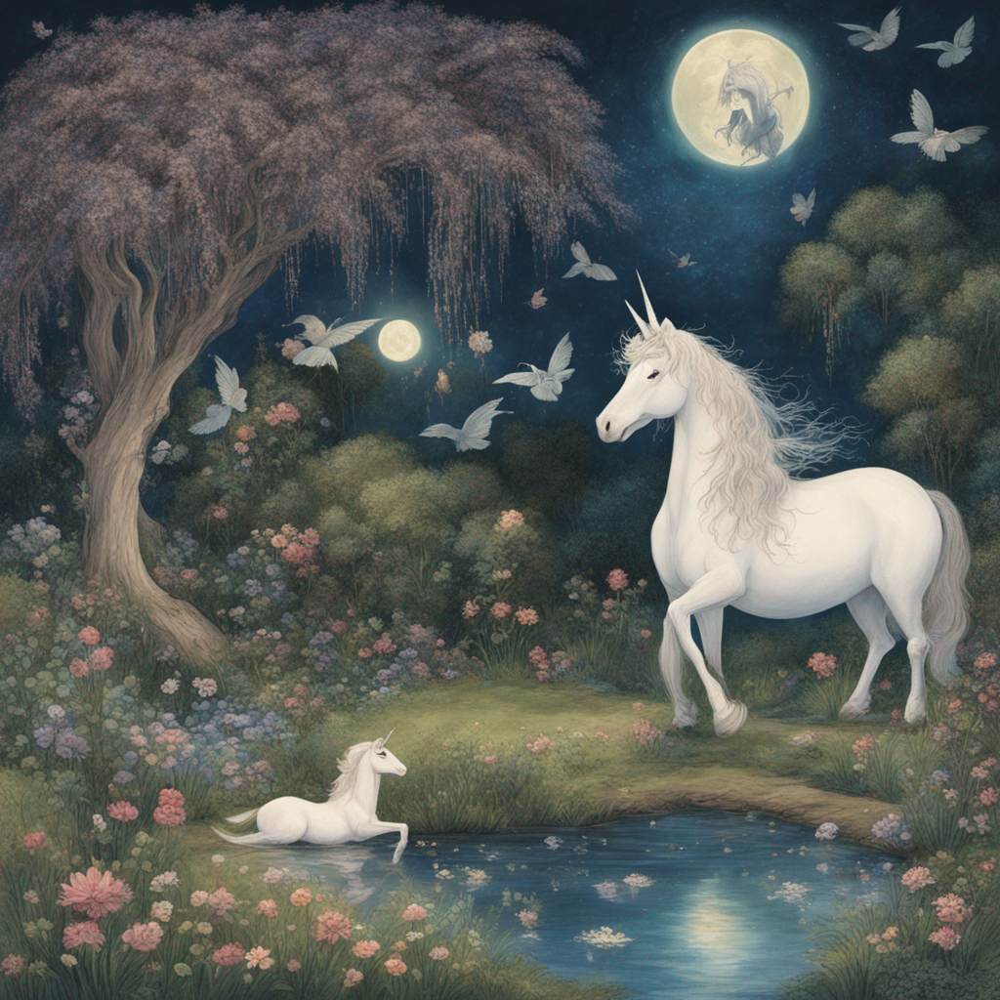

# CreativeAI-Portraits

## Project Overview
This portfolio showcases images generated using various versions of Stable Diffusion models, including the SDXL-Turbo. The images were created in a Colab notebook and demonstrate the model's capability to generate detailed, creative, and complex images from textual prompts.

### Objectives
- To explore and compare the capabilities of different versions of Stable Diffusion.
- To create a diverse set of images based on a range of prompts, showcasing creativity and detail.
- To serve as a mini-portfolio demonstrating the potential applications of AI-generated art.

## Generated Images

Below are the images generated using the specified versions of Stable Diffusion, along with the prompts used.

### SDXL Version Images

#### 1. Serene Lake Sunset Mountains
**Prompt**: "A serene landscape featuring a crystal-clear lake mirroring the vibrant, fiery hues of a sunset, with majestic mountains in the background and a field of wildflowers in the foreground."

#### 2. Astronaut Neon Alien Marketplace
**Prompt**: "An astronaut exploring a neon-lit alien marketplace, filled with various extraterrestrial species trading exotic goods, under a sky with three moons."

#### 3. Whimsical Crystal Forest
**Prompt**: "A whimsical forest with trees that have leaves of shimmering crystal, bioluminescent mushrooms dotting the path, and friendly forest creatures with glowing eyes."

#### 4. Medieval Banquet Castle Hall
**Prompt**: "A grand medieval banquet in a castle hall, with lords and ladies in elaborate attire feasting at a table laden with exotic dishes, as minstrels play in the background."

#### 5. Underwater City Merpeople
**Prompt**: "An underwater city with coral buildings, merpeople swimming through the streets, fish-like vehicles, and a grand palace made of pearl and seashell."

#### 6. PostApocalyptic Cityscape Nature
**Prompt**: "A post-apocalyptic cityscape where nature has reclaimed the ruins, with overgrown buildings, a river running through the main street, and survivors foraging for resources."

#### 7. Cyberpunk Street Noir
**Prompt**: "A cyberpunk street scene at night, with neon signs in multiple languages, diverse crowds, flying vehicles overhead, and a noir detective observing from the shadows."

#### 8. Ancient Library Monastery
**Prompt**: "A vast library in an ancient monastery, with towering shelves filled with ancient tomes, scrolls, and artifacts, and a secret passage hidden behind one of the bookcases."

#### 9. Magical Garden Midnight
**Prompt**: "A magical garden at midnight, with flowers that glow and change colors, fairies dancing around a moonlit pond, and a majestic unicorn resting under a willow tree."

#### 10. Epic Space Battle Galaxy
**Prompt**: "An epic space battle with sleek starships, exploding stars, and a massive space station, all set against the backdrop of a swirling galaxy."

## Technical Details

- **Environment**: Google Colab Notebook
- **Models Used**: SDXL-Turbo and stable-diffusion-xl-base-1.0 & stable-diffusion-xl-refiner-1.0 (refiner)
- **Languages & Libraries**: Python, PyTorch, diffusers library

## Observations and Insights

(Share any observations or insights you gained from creating these images. Discuss the differences you noticed between the different versions of Stable Diffusion, the challenges faced, and any interesting details about the prompts and the resulting images.)

## How to Use

(Provide instructions on how users can generate their own images using your Colab notebook. Include any requirements or steps they need to follow.)

## Future Work

(Outline any potential future expansions or experiments you plan to conduct with Stable Diffusion or other models.)

## Acknowledgements

(Acknowledge any resources, papers, or individuals that have contributed to this project.)

---

Generated with ❤️ using [Stable Diffusion](https://stablediffusionweb.com/)
